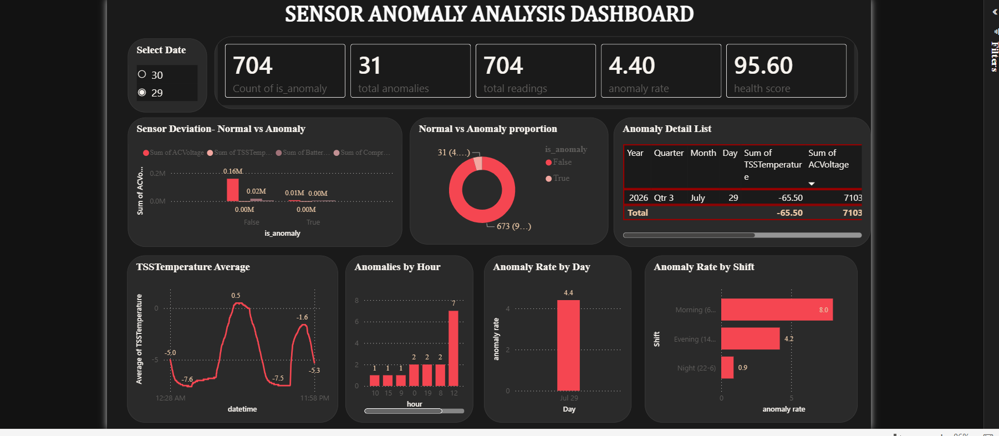
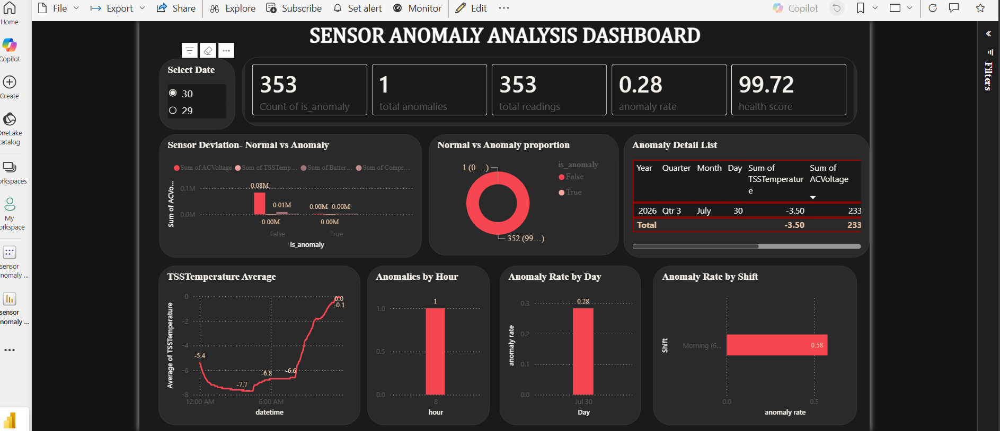

# sensor-anomaly-detection
Unsupervised anomaly detection on sensor data from a dairy cold-chain unit, using Python,
SQL, and Power BI. Built during a data science internship at Starlly Solutions Pvt Ltd (Spectra
IoT platform).

`Python` `SQL (SQLite)` `Scikit-learn` `Power BI`

**Status:** Completed

## Table of Contents
- [Executive Summary](#executive-summary)
- [Business Problem](#business-problem)
- [Methodology](#methodology)
- [Skills Used](#skills-used)
- [Results and Business Recommendations](#results-and-business-recommendations)
- [Next Steps](#next-steps)
- [Dashboard Preview](#dashboard-preview)

## Executive Summary

This project analyzes sensor data from a dairy cold-chain unit (Nhavi, Indapur site),
monitored via the Spectra platform, to detect abnormal equipment behavior before it leads to a
full failure or service ticket.

**The problem:** Operations teams monitoring cold-chain equipment can't manually review continuous
sensor streams for early signs of trouble, and no labeled failure history exists to train a
traditional predictive model against.

**The solution:** Raw sensor data was loaded into a SQL database, engineered into rolling-window
features, and passed through an unsupervised Isolation Forest model that flags abnormal readings
without needing any labeled failure data. Results were visualized in an interactive Power BI
dashboard.

**Impact:** The pipeline independently rediscovered real equipment events using sensor data alone,
identified which sensors actually drive abnormal behavior, and surfaced time-based patterns
(day-of-week, time-of-day) that point toward specific operational causes rather than random noise.

## Business Problem

Cold-chain units generate continuous multi-sensor readings (temperature, voltage, current,
battery), but without a system to flag deviations automatically, problems are typically noticed
only after a customer complaint or an outright failure. Without structured analysis, it's
difficult to answer:

- Which sensors actually indicate a developing problem, vs. normal noise
- Whether issues are isolated blips or sustained events
- When (day, time of day) problems are most likely to occur
- Whether flagged events share a common root cause or represent distinct issue types

### Business Impact

This analysis supports:
- **Operations teams** in catching equipment issues before a customer-facing failure
- **Field technicians** in prioritizing which alerts warrant a site visit
- **Data/product teams** in evaluating whether existing alert rules (rule-based thresholds) are
  actually catching the right things
- **Management** in understanding whether equipment issues are randomly distributed or
  concentrated in specific conditions worth investigating

## Methodology

### 1. Data Collection
- **Source:** Real Spectra IoT export, Nhavi (Indapur) dairy cold-chain site
- **Granularity:** 2-minute interval sensor readings
- **Period analyzed:** July 29–30, 2026 (1,050 readings after cleaning)
- **Sensors used:** AC Voltage, TSS Temperature, Battery Voltage, Compressor Current

### 2. SQL Layer
- Raw CSV loaded into a **SQLite** database (`sensor_data` table) rather than processed directly
  from file, to demonstrate a realistic data-access pattern
- Queries written for state-transition detection (`LAG()` window function), daily aggregation, and
  category counts

### 3. Data Cleaning & Feature Engineering (Python / Pandas)
- Combined separate date/time fields into a unified datetime index
- Verified numeric parsing on all sensor columns
- Engineered rolling averages (15-reading / ~30-minute window) per sensor to smooth noise and
  capture short-term trend, used alongside raw readings as model features

### 4. Modeling (Scikit-learn)
- **Isolation Forest**, an unsupervised anomaly detection algorithm — chosen specifically because
  no labeled failure data exists for this equipment
- Contamination rate set to 3% (flags the most unusual ~3% of readings)
- No feature scaling required (tree-based model is scale-invariant)

### 5. Validation & Insight Analysis
- Cross-checked flagged anomalies against real device status-register transitions already visible
  in the raw data, to confirm the model was catching genuine events, not noise
- Compared sensor averages during anomalous vs. normal readings, to identify which sensors
  actually drive the flags
- Broke down anomalies by day and by time-of-day shift
- Grouped anomalies within 10 minutes of each other into distinct "events" to distinguish sustained
  incidents from independent blips

### 6. Visualization (Power BI)
- KPI cards (Health Score, Total Anomalies, Anomaly Rate)
- Sensor trend charts with anomalies overlaid
- Anomaly-by-hour heatmap
- Voltage-vs-temperature scatter, colored by anomaly status
- Anomaly detail table for investigation

## Skills Used
- **SQL** (SQLite: aggregation, window functions, querying)
- **Python** (Pandas, NumPy — cleaning, feature engineering)
- **Machine Learning** (Scikit-learn: unsupervised anomaly detection with Isolation Forest)
- **Data Analysis** (event clustering, comparative/statistical analysis, root-cause hypothesis
  generation)
- **Power BI** (interactive dashboarding, DAX measures, conditional formatting)
- **IoT/Domain Understanding** (cold-chain equipment sensor behavior, status-register decoding)

## Results and Business Recommendations

### Key Insights
- **Temperature and compressor current — not voltage — drive the anomalies.** Both rose ~57%
  above their normal averages during flagged readings, while voltage barely moved. The model is
  catching a genuine compressor/cooling pattern, not electrical noise.
- **97% of anomalies occurred on a single day** of the sampled period, suggesting a one-off
  operational issue rather than an ongoing equipment problem.
- **Anomalies cluster heavily in daytime hours** (Morning 4.87%, Evening 4.18%) vs. an
  almost anomaly-free night period (0.49%) — worth checking against site operational schedules
  (e.g. milk collection/loading times).
- **32 flagged readings collapsed into just 8 distinct events**, including one sustained
  ~30-minute episode responsible for nearly half of all flags — evidence of a real incident, not
  scattered sensor noise. That specific event showed a voltage-drop signature distinct from the
  general temperature/compressor pattern, suggesting at least two different underlying issue types.

### Recommendations
- Investigate the July 29 sustained 30-minute event specifically — its voltage-drop signature
  differs from the site's general anomaly pattern and may indicate a separate power-quality issue.
- Review daytime operational activity (loading, door-opening frequency) as a likely contributor to
  the strong day/night anomaly split.
- Since temperature and compressor current are the primary anomaly drivers, prioritize monitoring
  and threshold tuning on those two sensors over voltage-based alerting.
- Treat the current 3% contamination threshold as a starting point — validate against operator
  feedback once results are reviewed, and adjust to reduce false positives/negatives.

## Next Steps
- Request a longer historical export (weeks/months) from the same site to confirm these patterns
  hold beyond the initial 2-day sample
- Confirm the real Faultcount bit-flag definitions with the technical/firmware team (currently
  inferred from data, not confirmed)
- Extend the pipeline to multiple sites for cross-site comparison
- Explore supervised classification if/when labeled failure or maintenance-ticket data becomes
  available
- Add automated alerting (e.g. email/Slack) triggered directly off the anomaly score

## Dashboard Preview

## Dashboard Preview

### Day 29

### Day 30

### Public Dashboard Link
[PowerBI_dshboard](https://app.powerbi.com/groups/me/reports/c2c262a0-697a-438b-b954-c59094b16315/12acebc5ac620720976e?experience=power-bi)
